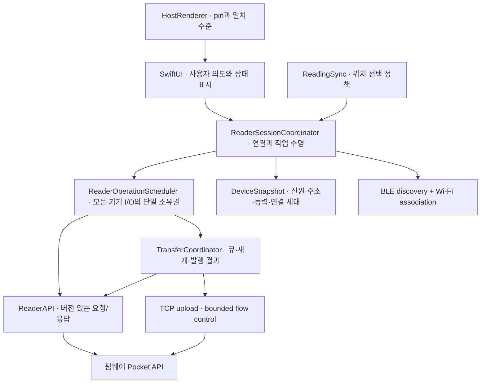

# 앱–펌웨어 연동 구조 평가

2026-09-29. 앱 `2757e805`, 펌웨어 `ccc601c5` 기준 소스 검토.
펌웨어의 아키텍처 개선은 별도 세션에서 진행 중이다. 이 문서는 앱 관점의 연동 경계와
공동 계약 변경 후보를 정리한다. 아래 목표 구조와 새 capability 이름은 **제안**이며,
구현되었거나 양쪽에서 합의된 계약이 아니다. 초기 평가는 제품 코드를 변경하지 않았다. 후속 구현 상태는 문서 마지막 절에 구분한다.

## 판단

BLE로 직접 연결을 준비하고 Wi-Fi로 데이터를 보내는 역할 분리, 기기 기능 광고,
원자적 파일 발행, 읽기 위치 제안, 사용자가 확인하는 펌웨어 설치는 유지할 가치가 있다.
새 통신 프레임워크보다 **모든 기기 작업의 소유권, 쓰기 대상 식별, 결과 확인을 같은
규칙으로 묶는 것**이 우선이다. 파일을 작게 나누는 것만으로는 아래 문제를 해결하지 못한다.

현재 앱은 `PocketModel`의 배타 작업 레인과 `CrossPointClient`의 호스트별 HTTP 큐를
갖췄다. 다만 자동 위치 교환은 별도 Task이고, HTTP 큐는 개별 요청만 직렬화한다.
TCP 스트림과 multipart 업로드는 별도 경로다. 따라서 "actor이므로 전부 순차 실행된다"거나
"HTTP 큐가 있으므로 전송 세션 전체가 보호된다"고 볼 수 없다.

## 이미 잘 마련된 경계

| 경계 | 근거 | 유지할 성질 |
| --- | --- | --- |
| 기기 작업 소유권 | [PocketModel](../Sources/PocketModel.swift), `startReaderWork`, `ownsReaderWork`, `quiesceReaderTraffic` | 취소 후 I/O가 끝날 때까지 작업 토큰 유지, heartbeat/설정 읽기 중단 |
| 요청 직렬화 | [CrossPointClient](../Sources/CrossPointClient.swift), `ReaderHTTPTransport` | 같은 호스트 HTTP 요청 직렬화, 탐색 중 다른 호스트는 병렬 가능 |
| 전송 | 같은 파일의 `PocketStreamUploader`, `uploadAtomically` | 고정 staging UUID, 재개, ACK 기반 흐름 제어, 크기/CRC 검사, commit 후 성공 |
| 카드 배포 | [ContentDeployment](../Sources/Studio/ContentDeployment.swift), [ContentActivationJournal](../Sources/Studio/ContentActivationJournal.swift), [ReaderContentTransport](../Sources/Studio/ReaderContentTransport.swift) | 응답 유실을 실패와 구별, 활성화 의도 보관, 상태 재조회로 결과 확인 |
| 화면/프로필 | [PocketProfile](../Sources/Studio/PocketProfile.swift), [ScreenPresentation](../Sources/Studio/ScreenPresentation.swift) | schema, deviceID, generation 기반 확인; 충돌 시 무조건 재전송하지 않음 |
| 읽기 위치 | [ReadingSync](../Sources/Sync/ReadingSync.swift), [PositionRecord](../Sources/Sync/PositionRecord.swift), [계약](READING_PROGRESS.md) | 동일 책 식별값·XPointer, 사용자 확인 없이 페이지 이동 금지, 실제 엔진 교차 fixture |
| 업데이트 | [FirmwareImageValidator](../Sources/FirmwareImageValidator.swift), `PocketModel.stagedFirmwareMessage` | 파일 검증, staging과 설치 구분, 리더의 두 번째 확인 유지 |
| 미리보기 아티팩트 | [검증 스크립트](../scripts/host_renderer_artifact.py), [PIN](../Support/PocketUIHost/PIN.json) | 호스트 라이브러리의 ABI·소스·바이너리 출처 검증 |

## 개선이 필요한 동작

### 1. 높음 — 자동 위치 교환이 작업 레인과 데모 전환을 우회한다

근거: `PocketModel.swift:379–405`의 `quietReadingExchange`, `:940`의 `enterDemoMode`,
`:216`의 `quiesceReaderTraffic`, `:1828`의 `startReaderWork`.

- quiet 작업은 시작 시 `!isWorking`, `!isDemoMode`를 확인하지만 `readerWorkTask`를 점유하지 않는다.
- 데모 진입과 새 연결은 진행 중인 `quietExchangeTask`를 취소/대기하지 않는다.
- status의 await 뒤에는 `Task.isCancelled`만 검사하고, 데모 상태나 연결 세대는 검사하지 않는다.
- 이후 위치 GET/POST와 완료 콜백에도 작업 소유권 검사가 없다. background는 quiet Task를
  취소하지만 다른 전환들이 같은 수명 규칙을 공유하지 않는다.

**발생 조건:** 미연결 상태에서 자동 probe를 시작하고 응답이 오기 전에 데모로 전환한다.
probe가 돌아오면 이후 읽기 위치 요청이 실행될 수 있다. 새 연결 또는 전송을 시작한 경우에는
이전 자동 교환이 새 작업과 겹칠 수 있다. 이것은 소스에서 확인한 실행 가능 경로이며,
실제 기기에서 재현한 전송 장애라는 뜻은 아니다.

**개선:** 자동 교환도 같은 작업 스케줄러가 소유하게 한다. 사용자 작업이 우선하도록
자동 교환을 취소하고 완료를 기다린 뒤 다음 작업을 시작한다. 모든 await 이후 세대·토큰·
데모/백그라운드 상태를 확인한다. 데모에는 네트워크 동작을 제공하지 않는 구현을 주는
방식은 추가 방어가 될 수 있지만 먼저 기존 수명 규칙을 완성해야 한다.

**완료 조건:** 지연된 probe/GET/POST 도중 데모 진입, 새 리더 선택, 전송 시작,
background 전환을 주입하는 테스트. 전환 완료 후 추가 쓰기와 오래된 콜백이 없어야 한다.
앱 단독 개선 가능; wire 변경은 필요하지 않다.

### 2. 중간 — iOS 복귀 시 위치 교환 요청 순서가 뒤집혀 있다

근거: `ContentView.swift:137–150`, `ReadingSync.swift:231`,
`ReadingSync+Reader.swift:18`, `PocketModel.swift:382`, `:419`, `:1879`.

`.active` 처리에서 `sync.nudgeReader()`를 먼저 호출하고, 뒤에서
`model.resumeForForeground()`로 `isInBackground`를 false로 만든다.
nudge는 동기적으로 모델을 호출하므로 background에서 돌아오는 시점의 quiet/연결 중 교환은
둘 다 guard에 걸려 반환한다. 이 active 처리 자체에는 재요청이 없다.
책 열기나 다른 상태 변화가 나중에 교환을 일으킬 수는 있다.

**개선:** foreground 복귀 처리를 완료한 뒤 nudge한다. 나아가 SwiftUI의 상태 관찰 callback
여러 개가 수명을 결정하지 않도록 `ReaderSessionCoordinator` 같은 단일 소유자가
foreground→가능 여부 확인→교환 요청 순서를 처리한다.

**완료 조건:** LAN 연결 유지/미연결 두 경우의 background→active 테스트. 직접 AP는
자동 재가입하지 않는 기존 정책을 유지한다. 앱 단독 개선 가능.

### 3. 높음 — 설정 쓰기의 대상 식별이 다른 Pocket API보다 약하다

근거: `PocketModel.swift:1408`, `CrossPointClient.swift:991`,
펌웨어 `src/pocket_daily/web/PocketEndpoints.cpp:1180`.

프로필·카드·파일 관리·읽기 API는 deviceID를 전달하고 검사한다. 반면 preferences POST는
호스트와 설정값만 보내며 펌웨어도 deviceID를 확인하지 않는다. `savePreferences`는
전송 직전 status 재검사도 하지 않는다.

**발생 조건:** A 리더에 연결한 뒤 주소가 다른 Pocket 리더 B를 가리키게 되고, 다음 heartbeat가
변경을 감지하기 전에 저장한다. B가 같은 preferences 경로를 제공하면 A용 설정을 수락할 수 있다.
이는 신뢰 LAN에서의 잘못된 대상 변경 문제이며 deviceID를 암호학적 인증으로 주장하지 않는다.

**개선:** 새 preferences capability/schema에 expected deviceID와 확인 응답을 포함한다.
가능하면 revision/CAS로 다른 앱이나 리더에서 바뀐 설정도 보호한다. 구 펌웨어는 별도 호환
정책을 두고 최소한 쓰기 직전 재검사하되, 재검사만으로 원자적인 대상 확인을 보장하지 않는다.
commit·transfer·session/end도 동일한 대상 확인 정책이 필요한지 공동으로 검토한다.

**완료 조건:** A의 세션으로 B에 설정을 쓰면 B의 저장값이 변하지 않고 충돌 응답을 받는다.
구 앱/신 펌웨어 조합에서 기존 저장 동작이 어떻게 취급되는지 명시한다. 양쪽 계약 변경 필요.

### 4. 중간 — 파일 발행 응답을 잃으면 결과가 불명확한 채 재전송 대상으로 남는다

근거: `CrossPointClient.swift:1214–1232`, `PocketModel.swift:1680–1698`,
펌웨어 `src/pocket_daily/web/PocketEndpoints.cpp:916–1030`.

리더는 staging을 target으로 옮긴 뒤 응답한다. 그 응답을 잃으면 앱은 예외를 받고 큐에 파일을
남긴다. commit 요청 자체에는 조회 가능한 영수증/작업 ID가 없다. 같은 commit을 재호출해도
staging이 이미 없어 검증을 통과하지 못한다. 사용자가 재시도하면 재업로드가 필요하며,
이미 성공한 교체의 부수 효과(기사 읽음 표시 초기화 등)도 다시 실행될 수 있다.

완성 파일 대신 부분 파일을 노출한다는 지적은 아니다. **파일 발행의 원자성과 클라이언트의
결과 확인은 별도 보장**이다. 카드 배포는 이미 이 구별을 구현했으므로 좋은 내부 선례다.

**개선:** `prepared → uploading → verifying → published/unknown` 상태를 큐에 보관한다.
양쪽이 지원하는 transfer ID+대상+크기/해시 기반 영수증 조회 또는 멱등 commit을 설계한다.
조회가 불가능한 구 펌웨어에서는 결과 미확인으로 표시하고 무조건 이전 파일이 유지됐다고
말하지 않는다. 현재 `ClientError.verificationFailed`의 "The previous file was kept"도
클라이언트의 응답 검증 실패까지 포괄하므로 항상 참인 설명은 아니다.

**완료 조건:** 서버 발행 직후 응답 유실/앱 종료/리더 재시작을 주입해 중복 발행 없이 확인하거나,
확인할 수 없음을 명확히 유지한다. 영수증 저장은 기기의 메모리·SD 예산에 맞게 제한한다.
응답 불명확 상태 표시는 앱에서 먼저 개선 가능; 확정 확인은 양쪽 계약 필요.

### 5. 중간 — 일반 파일 전송의 호환성 판정에 commit 지원 여부가 빠져 있다

근거: `CrossPointStatus`와 `CrossPointClient.uploadAtomically`,
`PocketModel.swift:1615–1668`; 현재 로컬 `upstream/master`의 서버에는
`/api/pocket/v1/commit` 경로가 없다.

앱은 X3/X4 status를 수락한다. 일반 책은 stream 광고가 없으면 multipart `/upload`로
폴백하지만, 그 뒤에는 항상 Pocket commit을 요청한다. status 모델에 commit 지원 능력은 없다.
따라서 순정 CrossPoint의 `/api/status`와 `/upload`가 있다는 사실만으로 앱의 원자적 전송을
지원한다고 볼 수 없다. Articles는 capability gate가 있지만 일반 파일 경로는 그렇지 않다.

**개선:** 전송 전 `atomicPublish`/`commit`에 해당하는 명시적 기능 협상을 한다(이름은 미정).
"구형 Pocket 펌웨어의 multipart+commit"과 "순정 CrossPoint의 브라우저 upload"를 구분한다.
순정에서 원자적 발행을 보장할 수 없으면 전송 전에 지원 범위와 업데이트/SD 경로를 안내한다.
완성 파일명으로 바로 쓰는 폴백을 조용히 넣어 기존 안전 규칙을 낮추지 않는다.

**완료 조건:** 순정 status, 구 Pocket status, 현 Sync/브라우저 프로필을 fixture로 두고,
미지원이면 staging 파일을 보내기 전에 거절한다. 양쪽 capability 계약 및 앱 호환 정책 필요.

### 6. 중간 — 미리보기의 아티팩트 검증과 연결된 리더와의 일치 판정은 다르다

근거: `ReaderDisplayState.swift:68,103`, `HostRendererBridge.swift:80`,
`Support/PocketUIHost/PROVENANCE.json`.

`matchesPreviewFont`는 pointSize == 12만 검사한다. fontFamily가 달라도 크기가 12이면
"Matches this reader"라고 표시한다. 이 판정에는 폰트 파일 해시나 리더 renderer revision도 없다.
로컬 아티팩트는 pin 검증에 성공했지만 그 출처는 `75df8f0e`이며, 평가 시점의 펌웨어와
manifest 내 24개 입력 파일이 다르다. 이 수치가 모두 픽셀 차이를 뜻하지는 않지만,
검증된 아티팩트가 현재 기기와 같다는 증거가 되지도 않는다. 최근 Articles 버튼 변경도
Home painter 차이에 포함된다.

**개선:** 우선 문구를 "리더에서 읽은 레이아웃 적용" 수준으로 제한하고 font family도 비교한다.
정확 일치를 제공하려면 renderer 호환 ID·사용 폰트 hash·관련 입력을 비교한 뒤에만 표시한다.
기기 실측 프레임, 동일 renderer로 만든 로컬 미리보기, 기본 참고 미리보기를 구분한다.
앱/펌웨어 릴리스에 renderer pin 조합을 기록하되 매 펌웨어 수정마다 무조건 재빌드하지 않는다.

**완료 조건:** 같은 크기/다른 폰트, 같은 ABI/다른 painter, 구 펌웨어/새 앱에 대해
정확 일치라고 잘못 표시하지 않는다. 문구·판정은 앱 단독, 엄밀한 parity는 공동 계약 필요.

## 목표 구조

아래 이름은 책임을 설명하기 위한 제안이다. 별도 패키지나 프레임워크를 반드시 만들라는 뜻은 아니다.

- 세션 대상은 `{deviceID?, host, httpPort, capabilities, generation}` 값으로 묶는다.
  기억한 대상도 host만이 아니라 port와 ID를 함께 저장한다. 현재 quiet 교환은 port 80으로
  고정돼 있어 Bonjour/수동 연결로 다른 포트를 선택해도 다음 자동 교환에 보존되지 않는다.
- 자동 교환, 설정, 전송, 세션 종료는 같은 스케줄러에 들어가며 사용자 요청을 우선한다.
  heartbeat는 낮은 우선순위이며 파일 전송 동안 중단한다.
- `ContentView`는 BLE 이벤트를 HTTP 세션으로 연결하거나 background 순서를 정하지 않는다.
  플랫폼 이벤트를 세션 소유자에게 전달한다.
- `ReadingSync`는 후보 선택/저장 규칙을 유지하고, 연결·재시도·취소는 세션에 맡긴다.
- `CrossPointClient`에는 여러 정책 대신 wire 인코딩/검증을 남긴다. TCP stream과 HTTP를
  파일로 분리하는 것보다 먼저, 둘을 가로지르는 작업 소유권을 고정한다.
- `DeviceMirror`와 `PocketModel`의 중복 상태는 한쪽을 권위 있는 상태로 정하고 점진적으로
  줄인다. 현재 `DeviceSession`은 mirror/syncMode 두 속성뿐이라 I/O 대체 경계로는 부족하다.
- 기존 JSON schema와 기능별 버전을 유지한다. 범용 이벤트 버스, 새 서버, 항상 켜진 BLE/WS,
  거대한 통합 protocol version은 현재 문제를 푸는 데 필요하지 않다.

## 실행 순서와 공동 계약 검증

| 순서 | 작업 | 소유 | 핵심 검증 |
| --- | --- | --- | --- |
| 1 | quiet 교환을 공통 수명에 편입, foreground 순서 수정 | 앱 | 지연 응답/데모/새 연결/전송/background 회귀 |
| 2 | 대상 값과 capability admission 정리 | 앱 + 펌웨어 | 순정/구 Pocket/현 프로필, ID 변경, 필드 누락·알 수 없는 버전 |
| 3 | preferences 대상 확인, 전송 결과 미확인 상태/영수증 | 공동 계약 | 잘못된 대상 거절, 응답 유실 후 read-only 확인 |
| 4 | 세션/전송 책임 추출, 중복 UI 상태 축소 | 앱 | 기존 동작과 취소 순서 유지; 폴더 재배치만으로 완료하지 않음 |
| 5 | renderer 일치 수준, 호환 조합을 CI로 고정 | 앱 + 펌웨어 | accepted artifact 검증 + font/renderer 불일치 fixture |

기존 테스트에는 실제 TCP 흐름 제어/취소, HTTP 직렬화, 카드 활성화 결과 확인,
XPointer 교차 검증이 포함된다. 이 자산을 유지하면서 위의 세션 간 전환을 추가해야 한다.
앱 트리에 `.github/workflows`가 없으므로 저장소 내 GitHub Actions 기반 앱 검증은 없다.
외부 CI 유무까지 조사한 것은 아니다.

계약 fixture는 양쪽이 같은 버전으로 소비할 수 있게 고정한다. 기기 런타임에 OpenAPI 엔진을
넣을 필요는 없다. status/route 가용성, 요청과 응답, 오류 코드, 허용 크기/경계값을 공유 fixture로
검증하고, 새 앱+구 펌웨어/구 앱+새 펌웨어 조합을 release record에 남긴다.
호스트와 시뮬레이터 테스트는 물리 BLE/Wi-Fi/SD/OTA 검증을 대신하지 않는다.

## 이번 검증

- iOS 26.5 / iPhone 17 Pro 시뮬레이터: `PocketTests` **400/400 통과**.
  `xcodebuild test -scheme Pocket -only-testing:PocketTests CODE_SIGNING_ALLOWED=NO`.
- macOS: `PocketMacReaderTests/testFirmwareXPointersResolveToTheSameText` 통과.
  펌웨어 fixture의 XPointer **430/430**이 앱 엔진에서 같은 텍스트로 해석됨. skip 아님.
- `host_renderer_artifact.py verify Support/PocketUIHost` 통과.
  `test_host_renderer_artifact.py` **2/2 통과**.
- 문서 상대 링크와 `git diff --check` 확인.
- 테스트 로그/derived data: 로컬 `.build/integration-audit/` (미추적).

위 문제는 소스 대조에 따른 발견이며, 기존 테스트 통과가 해당 경계 사례들을 검증했다는
뜻은 아니다. iOS/macOS 테스트 빌드는 성공했지만 release/서명/App Store 검증은 하지 않았다.
펌웨어 재빌드와 물리 BLE·Wi-Fi·SD·OTA·힙 검증은 이번 범위에 포함하지 않았다.
초기 평가에서는 제품 코드와 펌웨어 저장소를 수정하지 않았다. 아래 후속 구현과 검증은 별도다.

## 후속 구현 — 2026-09-29

위 본문은 수정 전 기준의 평가다. 후속 작업은 펌웨어 저장소를 바꾸지 않고 기존 계약 내에서
앱의 보호 장치를 보강했다.

- quiet 교환을 공통 작업 레인에 편입했다. 사용자 작업이 우선하며 취소 후 predecessor를
  기다린다. 데모/직접 연결/background 전환과 각 await 이후에 기존 소유권을 확인한다.
- iOS foreground 복원 후 nudge하도록 순서를 고쳤다.
- 두 설정 저장 경로 모두 직전 status의 deviceID를 확인한다. 이것은 위험을 줄이는
  앱 측 방어이며, probe와 POST 사이의 대상 교체를 원자적으로 차단하지는 않는다.
- 기존 Pocket 전송 광고가 없는 일반 파일 전송을 업로드 전에 차단한다. 새 capability를
  임의로 정의하지 않았다. 보수적으로 거절되는 구 펌웨어는 명시적인 호환 fixture가 필요하다.
- commit 전에 `publicationPending`을 영속화한다. 확인 실패/중단 후 재전송을 막고 리더 확인과
  prepared copy 제거를 안내한다. 재시작해도 기록을 유지한다. 서버 영수증 조회는 아직 없다.
- 미리보기는 폰트 family와 크기를 함께 비교하고, 문구를 reader layout으로 낮췄다.
  renderer hash가 같다는 뜻이나 물리 화면의 픽셀 일치를 주장하지 않는다.

펌웨어 세션에 남는 공동 계약: preferences의 서버 측 deviceID/CAS 검증,
명시적 원자 발행 capability, bounded publication receipt/멱등 commit,
renderer 호환 ID와 폰트 식별. 자동 설치나 기존 펌웨어의 엄격한 파서가 모르는 필드는 추가하지 않았다.

### 후속 구현 검증

- iOS 전체 `PocketTests`: **408/408 통과** (기존 400 + 회귀 8).
- 추가 회귀: quiet probe 지연 중 데모/background, 연결 교체 전 predecessor drain,
  foreground 복귀와 진행 중 GET 취소, 설정 대상 ID 변경, 순정 status 전송 거절,
  commit 응답 유실과 write-ahead marker, 재시작 후 미확인 큐 재전송 차단, 폰트 family 불일치.
- Mac 앱 빌드 성공. 변경 후 Mac XPointer 교차 검증 **430/430 통과**.
- iPhone UI **22/22 통과**. iPad 최초 실행 **17/22 통과**, 실패 5개는 시뮬레이터를
  재시작한 뒤 제품/테스트 코드 수정 없이 **5/5 재실행 통과**. 최초 실패에는 UI 이벤트와
  snapshot timeout 및 화면 assertion 실패가 포함됐으며, 단일 실행 전체 성공으로 기록하지 않는다.
- `capture_screenshots.sh`를 capture-only 설정으로 다시 실행해 iPhone 6장/iPad 7장/Mac 6장
  생성 및 Mac 테스트 통과. 세 플랫폼의 대표 화면과 변경된 iPad 6장을 시각 확인했다.
  화면 내용은 기존 캡처와 같고 iPad 상태바 날짜만 달라 해당 바이너리 변경은 제외했다.
  `validate_app_store.sh` 통과. App Store 제출/승인을 뜻하지 않는다.
- 기존 테스트의 Swift concurrency 경고는 남아 있다. 무경고 빌드로 표현하지 않는다.
- 물리 BLE/Wi-Fi/SD/업데이트 설치는 검증하지 않았다. commit/push/release 없음.

## 펌웨어 통합 완료 후 앱 반영 — 2026-09-30

펌웨어 `ee188fe7`(CrossPoint 1.6.5 통합)을 기존 `ccc601c5` 기준과 대조했다.
BLE nearby 레코드, 업로드 스트림, status capability, reading-progress v1 계약은
유지된다. preferences의 `fontSize`는 앱의 기존 0~3 값을 그대로 받고
`LegacyFontSize`에서 12/14/16/18pt로 변환한다. 서버 측 대상 검증과 publication
receipt는 새로 추가되지 않았으므로 위 공동 후속 과제는 여전히 남는다.

추가 반영은 앱의 host renderer 패키지로 제한했다. 최종 펌웨어 소스로 Apple 5개
아키텍처/플랫폼 slice를 새로 빌드하고 출처/해시 검증 후 import했다. 공개 C 헤더와
ABI 1은 동일하며 Swift 코드, 테스트, 프로젝트 설정, 폰트 자산은 그대로 유지했다.
Pocket Reader 안의 Articles action과 통합된 렌더러가 앱 미리보기에도 반영된다.
정확한 pin과 백업 정책은 [HOST_RENDERER.md](HOST_RENDERER.md)에 기록했다.
반영 전 기존 변경 파일의 해시/patch를 `.build/firmware-followup/`에 보관했고,
import 직후 기존 변경 파일이 모두 동일함을 확인했다. 펌웨어 소스는 수정하지 않았다.

검증: 새 artifact로 iOS **408/408 통과**, Mac 테스트 및 두 시뮬레이터의 capture 테스트
통과. 기존 Mac suite에는 최신 sibling의 XPointer fixture 교차 검증이 포함된다.
세 플랫폼 캡처 **19장**을 재생성해 변경 부분을 시각 확인했고, 실제 미리보기가 달라진
5장만 변경으로 남겼다. 나머지 날짜만 바뀐 4장은 기존 파일을 유지했다.
artifact 검증, importer 테스트 2개, App Store source validator, diff 공백 검증 통과.
기존 Swift 경고는 남아 있으며 물리 기기 픽셀 parity/BLE/Wi-Fi/OTA는 이번에 검증하지 않았다.
