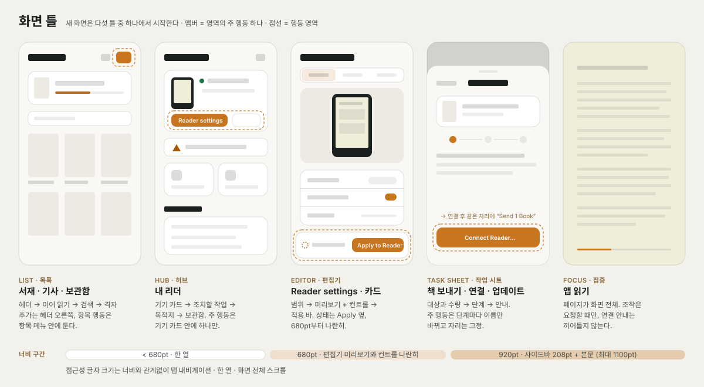
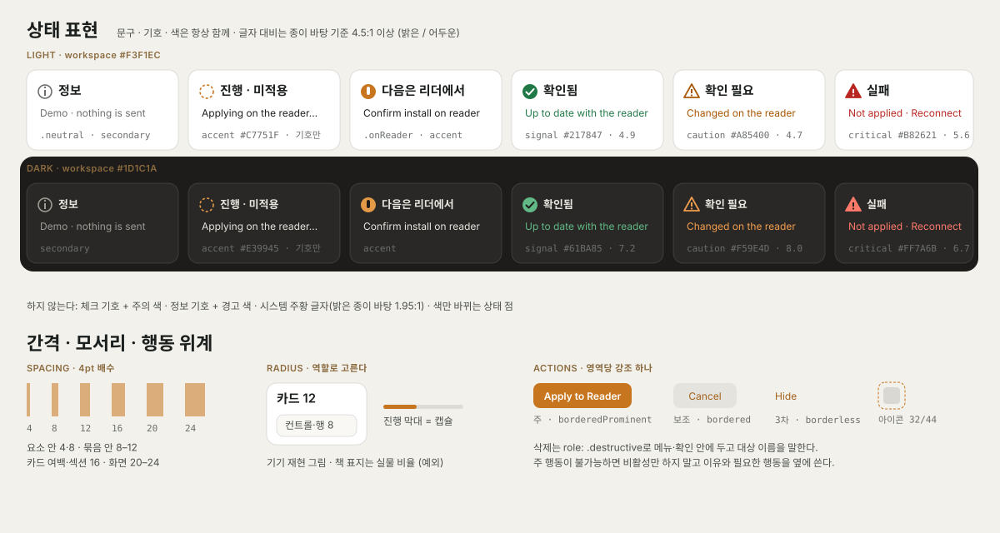

# Pocket Daily 디자인 시스템

2026-10-09. 공통 규격은 `Sources/PocketDesign.swift`, 색상과 상태 표현은
`Sources/PocketPalette.swift`에서 정의한다. [제품 UX 명세](PRODUCT_UX_SPEC.md)는
화면별 책임과 작업 흐름을, 이 문서는 모든 화면에 공통으로 적용하는 판단
규칙과 레이아웃 규칙을 정한다. 시각 참고 자료는 `docs/design/`에 있다.



## 방향

종이색 바탕, 차분한 잉크색, 앰버 포인트를 유지한다. 화면 제목과 현재 작업이
먼저 읽혀야 하며, 브랜드 장식과 설명이 콘텐츠를 아래로 밀어내지 않게 한다.
상태는 문구로 설명하고, 주요 행동과 선택에만 강한 강조를 쓴다.

## 사용성 원칙

각 원칙은 화면을 검토할 때 예·아니요로 판정할 수 있게 쓴다.

1. **한 영역, 한 주 행동.** 보이는 작업 영역마다 강조 버튼
   (`.borderedProminent`)은 하나다. 두 행동이 경쟁하면 하나는 보조로 낮추거나
   메뉴로 옮긴다. 주 행동의 이름은 결과를 말한다: `Send 1 Book`, `Apply to Reader`.
2. **상태는 문구·기호·색을 함께 쓴다.** 색만으로 상태를 구분하지 않는다. 같은
   의미는 앱 어디서나 같은 기호와 색을 쓴다(아래 [상태 표현](#상태-표현)).
3. **출발한 맥락을 유지한다.** 연결·확인·작업 시트는 이를 연 창과 화면 위에서
   열고, 닫으면 같은 분류·스크롤·선택으로 돌아온다. 완료 후 다른 목적지로
   강제로 이동하지 않는다.
4. **범위를 이름으로 말한다.** 적용·삭제·되돌리기 행동 근처에 대상(Home, Sleep,
   Reading Preferences, 책 제목, 기기 이름)을 보여 준다. “모두”처럼 범위가
   모호한 행동은 영향을 먼저 보여 준다.
5. **되돌릴 수 없는 행동은 한 번 더 멈춘다.** 삭제·제거·연결 해제는
   `role: .destructive`와 대상 이름이 들어간 확인, 원본에 미치는 영향(앱 사본 유지
   여부)을 함께 둔다. 펌웨어처럼 기기를 바꾸는 행동은 확인 제목에 기기와 버전을
   쓰며, 앱의 확인이 기기의 두 번째 확인을 대신하지 않는다.
6. **읽기는 기기를 기다리지 않는다.** 서재와 앱 읽기에는 연결 요구, 권한 요청,
   기기 안내가 끼어들지 않는다. 연결이 필요한 행동은 그 행동의 위치에서 안내한다.
7. **관측과 추정을 구분한다.** 기기에서 확인한 값은 확인 시점과 함께,
   마지막으로 알던 값은 “Last seen”처럼 구별해 보여 준다. 확인되지 않은 성공을
   성공 색으로 표시하지 않는다.

## 레이아웃 규칙

### 화면 골격

모든 목적지는 위에서 아래로 같은 세 영역을 가진다.

| 영역 | 내용 | 규칙 |
| --- | --- | --- |
| 헤더 | 대상, 화면 제목, 화면 단위 행동(추가·설정·옵션) | 한 줄을 우선한다. 넘치면 행동을 다음 줄로 내리고 제목은 자르지 않는다 |
| 본문 | 콘텐츠, 목록, 미리보기와 컨트롤 | 최대 폭 1100pt, 가로 여백은 넓은 화면 20pt·작은 서재 16pt |
| 행동 영역 | 현재 과업의 주 행동과 그 상태 | 편집기는 하단 적용 바, 작업 시트는 시트 툴바 또는 하단 한 곳 |

상태 문구는 그 상태를 바꾸는 행동 바로 옆에 둔다. 적용 상태는 Apply 옆, 전송
진행은 Stop 옆에 둔다. 앱 전역 결과는 공통 `StatusCallout` 한 곳에서 보고한다.

### 화면 틀

새 화면은 아래 다섯 틀 중 하나에서 시작한다. 틀을 섞어야 한다면 화면을 나눈다.

| 틀 | 예 | 구성 | 주 행동 위치 |
| --- | --- | --- | --- |
| 목록 | 서재, 기사, 기기 보관함 | 헤더 → (이어 읽기) → 검색·필터 → 격자 또는 행 | 헤더 오른쪽의 추가. 항목 행동은 항목 메뉴 |
| 허브 | 내 리더 | 기기 카드(상태·주 행동) → 조치할 작업 → 목적지 카드 → 보관함 | 기기 카드 안 하나 |
| 편집기 | Reader Settings, 카드·날씨 편집 | 범위 선택 → 적용 바 → 미리보기 + 컨트롤 | 적용 바의 Apply to Reader. 분할 배치는 범위 선택 바로 아래, 한 열은 하단에 고정해 스크롤 없이 보인다 |
| 작업 시트 | 책 보내기, 연결, 업데이트 | 대상과 수량 → 현재 단계 → 단계별 안내 | 시트의 같은 자리에서 단계에 따라 이름만 바뀜 |
| 집중 | 앱 읽기 | 페이지 전체, 최소 조작은 요청할 때만 | 없음. 페이지 넘김이 행동 |

작업 시트의 주 행동은 위치를 바꾸지 않는다. 행동 영역은 시트 하단에 고정해
목록이 길어져도 접히지 않게 하고, 연결 카드처럼 단계별 내용만 본문에서 바뀐다. `Connect Reader…`가 연결 후
`Send 1 Book`으로 바뀌어도 같은 자리에 있어야 사용자가 다시 찾지 않는다.

### 너비 구간

| 구간 | 기준 (`PocketDesign`) | 배치 |
| --- | --- | --- |
| 좁음 | 680pt 미만 | 한 열. 편집기의 미리보기는 작게 두고 눌러서 전체 크기 |
| 분할 | `splitLayoutWidth` 680pt 이상 | 편집기와 콘텐츠 시트가 미리보기와 컨트롤을 나란히 |
| 넓음 | `wideLayoutWidth` 920pt 이상 | 사이드바 208pt + 본문. 미만이면 탭 내비게이션 |
| 낮음 | 한 열 편집기의 높이가 `condensedEditorHeight` 430pt 미만 | 미리보기를 줄이고 적용 바는 상태 한 줄 + 행동만 |
| 큰 글자 | 접근성 글자 크기 | 너비와 관계없이 탭, 한 열, 화면 전체 스크롤 |

화면마다 다른 숫자로 구간을 나누지 않는다. 구간 안의 미세 조정은
`ViewThatFits`로 한 줄 배치와 세로 배치 중 맞는 쪽을 고른다.

### 정렬과 간격

- 텍스트와 컨트롤은 앞쪽(leading) 정렬이 기본이다. 가운데 정렬은 빈 상태와
  단일 확인 화면에만 쓴다.
- 아이콘은 `PocketSymbol` 칸에 넣어 같은 목록의 글자가 같은 위치에서 시작하게
  한다. 아이콘과 이름 사이 간격은 사이드바 10pt, 섹션 라벨 8pt.
- 간격은 4pt 배수를 쓴다. 관계가 가까울수록 좁게 둔다.

| 관계 | 간격 |
| --- | --- |
| 한 요소 안 (제목–보조 문구, 아이콘–글자) | 2–4 / 8pt |
| 같은 묶음의 항목 사이 | 8–12pt |
| 카드 안 여백, 섹션 사이 | 16pt |
| 화면 가장자리, 큰 영역 사이 | 20–24pt |

## 행동 위계

| 등급 | 형태 | 용도 | 규칙 |
| --- | --- | --- | --- |
| 주 | `.borderedProminent`, 앰버 | 현재 과업을 끝내는 하나 | 영역당 하나. 불가능할 때는 비활성 대신 이유와 필요한 행동을 옆에 표시 |
| 보조 | `.bordered` | 취소·대안·미리보기 열기 | 주 행동 옆, 주 행동보다 앞쪽 |
| 3차 | `.borderless`, 링크형 | 숨기기·자세히 보기 | 본문 흐름 안에서만 |
| 아이콘 | `PocketActionGlyph` | 헤더와 행의 반복 행동 | 행동 영역 Mac 32pt·iOS 44pt, 접근성 이름 필수 |
| 파괴 | `role: .destructive` | 삭제·초기화·기기에서 제거 | 메뉴 또는 확인 대화상자 안. 강조 버튼으로 두지 않음 |

시트 툴바의 확인·취소 위치는 플랫폼 기본을 따른다. 범위·필터처럼 하나를
고르는 메뉴는 메뉴 안에 `Picker`를 넣어 현재 값에 체크 표시가 나오게 한다. 같은
모양의 버튼 행으로 선택지를 늘어놓지 않는다. 메뉴는 행동이 세 개
이상이거나 드물게 쓰는 행동을 숨길 때 쓰고, 주 행동을 메뉴 안에 숨기지 않는다.

## 상태 표현



`StatusTone`이 상태의 의미를, `StatusTone.color`와 `StatusTone.symbol`이 그
모양을 정한다. 상태 줄은 `PocketStatusLabel(text, tone:, symbol:)`로 그린다.
기호만 상태 색이고 문구는 기본 글자색이다. 화면에서 상태 문구를 그릴 때 시스템 `.red`, `.orange`, `.green`을
직접 쓰지 않는다.

| 의미 | 토큰 | 기호 | 쓰는 경우 |
| --- | --- | --- | --- |
| 정보 | `.secondary` | `info.circle` | 데모, 리더 없이 미리보기, 설명 |
| 진행·미적용 | `PocketPalette.accent` | `arrow.triangle.2.circlepath`, `circle.dashed` | 적용 중, 연결 중, 적용 전 초안 |
| 다음은 리더에서 | `PocketPalette.accent` (`.onReader`) | `hand.tap.fill` | 펌웨어 설치 확인처럼 기기에서 할 일 |
| 확인됨 | `PocketPalette.signal` (`.success`) | `checkmark.circle(.fill)` | 기기가 저장·반영을 확인, 연결됨 |
| 확인 필요 | `PocketPalette.caution` (`.pending`) | `exclamationmark.triangle`, `pause.circle.fill` | 중지·미확인·충돌·다른 기기의 초안 |
| 실패 | `PocketPalette.critical` (`.failure`) | `exclamationmark.triangle.fill`, `xmark.octagon` | 실패·차단. 문구에 복구 행동 포함 |

- 상태 줄(적용 바, `StatusCallout`)은 기호에만 상태 색을 쓰고 문구는 기본
  글자색으로 둔다. 앰버는 밝은 종이 바탕에서 3.1:1이라 글자색으로 쓰지 않는다.
  필드 아래 오류처럼 기호 없이 문구만 있는 경우에만 `caution`·`critical`을
  글자에 쓴다.
- 상태 색은 종이 바탕 위 글자 대비 4.5:1 이상이다. 시스템 주황(1.95:1),
  빨강(3.15:1), 초록(1.97:1)은 밝은 종이 바탕의 캡션 글자로 읽히지 않아
  2026-10-09에 토큰으로 바꿨다. 확인 필요 4.7:1, 실패 5.6:1, 확인됨 4.9:1.
- `caution`은 브랜드 앰버와 색상이 가깝다. 그래서 확인 필요는 항상 경고 기호와
  함께 쓰고, 앰버는 선택·진행·주 행동에만 쓴다.
- 기호와 색은 같은 의미여야 한다. 체크 기호에 주의 색을 쓰거나 정보 기호에
  경고 색을 쓰지 않는다.
- 진행 중 상태는 문구를 바꾸되 포커스를 옮기거나 알림을 반복하지 않는다.

## 빈 상태, 오류, 대기

| 상황 | 보여 줄 것 | 피할 것 |
| --- | --- | --- |
| 비어 있음 | 이곳에 무엇이 오는지 한 줄 + 행동 하나(책 추가, 리더 연결) | 기능 소개 문단, 여러 선택지 |
| 검색 결과 없음 | 찾은 것이 없다는 한 줄 + `Clear Search` | 빈 목록이나 빈 제목만 남기기 |
| 대기·진행 | 지금 하는 일, 가능한 경우 진행률, 중지 | 화면 전체를 막는 진행 표시, 반복 포커스 이동 |
| 입력 오류 | 해당 필드 바로 아래 캡션, 무엇을 고치면 되는지 | 저장 버튼만 비활성화하고 이유 숨기기 |
| 화면에 남는 오류 | `PocketStatusLabel` + 보이는 `Dismiss` | 눌러야 사라지는 숨은 동작 |
| 작업 실패 | 무엇이 안 됐는지, 앱 데이터가 안전한지, 다음 행동 | `Error:` 접두어, 원문 오류 코드만 표시 |
| 일부 완료 | 항목별 완료·실패·미전송 | 전체를 하나의 실패로 표시 |

## 문구

- 버튼은 동사로 시작하고 결과를 말한다. 더 입력이나 선택이 필요하면 `…`을 붙인다.
- 고정 용어: `Send to Reader…`(서재의 진입), `Apply to Reader`(편집 적용),
  `Connect Reader…`, `Manage Reader`, `Reader Settings`. 같은 행동에 다른 말을
  만들지 않는다.
- 대소문자는 Apple 스타일 가이드를 따른다. 버튼, 메뉴 항목, 메뉴형 필터,
  화면 제목, 아이콘 버튼의 접근성 이름은 제목 표기(Title Case)다: 모든 단어의
  첫 글자를 대문자로 쓰되, 가운데 오는 관사(a, an, the), 등위 접속사(and, or,
  but), 네 글자 이하 전치사(to, for, from, with, in, on…)는 소문자로 둔다.
  `Move Up`처럼 부사로 쓰인 단어는 대문자다. 상태 문구, 설명, 캡션, 대화상자
  본문, 선택지의 값(`Extra large`)은 문장 표기다.
- 문장 안에서 버튼을 가리킬 때는 버튼 표기 그대로 쓴다: `then tap Verify Connection.`
  표기를 바꾸면 그 이름을 쓰는 안내 문구, UI 테스트, App Store 심사 문서를 같은
  변경에서 고친다.
- 상태 문구는 `결과 · 다음 행동` 형식을 쓴다. 예: `Not applied · Reader went offline`.
- 수량과 대상은 숫자와 이름으로 쓴다: `Send 2 Books`, `Delete “Dune” from Reader`.
- 기기는 사용자에게 “reader”로 부른다. 제조사나 펌웨어 이름은 호환성 설명에만
  정확하게 쓴다.

## 공통 규격

| 역할 | 기준 |
| --- | --- |
| 화면 제목 | Mac 22pt semibold, iOS/iPadOS Dynamic Type의 title2 semibold |
| 본문/행/보조 문구 | 플랫폼의 body, subheadline, caption을 의미에 맞게 사용 |
| 기본 간격 | 4pt 배수. 주로 8 / 12 / 16 / 20 / 24pt |
| 본문 가로 여백 | 넓은 화면 20pt, 작은 서재 화면 16pt |
| 콘텐츠 폭 | 최대 1100pt |
| 사이드바 | 208pt, 일반 행 최소 Mac 36pt / iPad 44pt |
| 카드·묶음 목록·알림 | 내부 여백 16pt, 모서리 12pt(`cardRadius`), 얇은 경계선 |
| 검색/선택 행·컨트롤 | 모서리 8pt(`controlRadius`) |
| 아이콘 행동 영역 | Mac 32pt, iOS/iPadOS 44pt |

모서리는 역할로 고른다: 카드처럼 내용을 담는 면은 12pt, 그 안의 컨트롤과 행은
8pt, 진행 막대는 캡슐. 기기 재현 그림과 책 표지는 실물 비율을 따르므로 예외다.

고정된 행 높이로 글자를 자르지 않는다. 행 높이는 최소값이며 큰 글자와
여러 줄 텍스트에 따라 늘어난다. iOS 제목과 공통 아이콘은 Dynamic Type을 따른다.
접근성 글자 크기에서 서재는 표지와 제목을 가로로 배치한 한 열 목록을 사용하고
제목·저자에 줄 수 제한을 두지 않는다. 기본 글자 크기에서는 표지 격자를 유지한다.
리더 설정은 접근성 글자 크기에서 화면 전체를 스크롤하고, 미리보기는
Show Preview로 연다. 적용 상태와 버튼은 세로로 배치해 편집 공간을 가리지 않는다.
보관함 제목과 추가 행동도 한 줄에 들어가지 않으면 세로로 배치한다.

## 색

| 토큰 | 역할 |
| --- | --- |
| `workspace` | 모든 목적지의 창 바탕 |
| `panel` | 사이드바, 이어 읽기 카드, 묶음 목록 |
| `card` | 바탕 위 반투명 카드 |
| `stage` | 편집기 미리보기 뒤의 깊은 바탕 |
| `ink`, `line` | 표시와 점, 얇은 경계선 |
| `accent` | 선택, 진행, 주 행동 |
| `signal` | 연결됨, 확인된 결과 |
| `caution`, `critical` | 확인 필요, 실패 |

밝은 화면은 따뜻한 종이, 어두운 화면은 따뜻한 숯색이다. 앱 외관은 시스템을
따르며 책 페이지의 Paper·White·Night 테마와 독립이다.

## 헤더와 내비게이션

- Mac 창 제목은 숨기고 브랜드는 사이드바에 한 번 표시한다. 넓은 화면의
  본문 헤더가 제목 표시줄 공간까지 사용한다. 창 조작 버튼이 있는 사이드바에는
  실제 창의 상단 안전 영역을 남겨 브랜드와 겹치지 않게 한다.
- 서재와 리더 화면은 같은 제목 위계를 쓴다. 서재의 장식용 부제는 제거하고,
  제목·추가·설정을 한 줄에 배치한다. 필요한 연결 상태만 보조 줄로 표시한다.
- My Reader는 기기 상태·작업·보관함을 한 화면으로 모은다. Reader Settings는 기기 카드의 행동이며, Manage Reader는 기기 옵션 메뉴에서 연다. 설정 범위는 편집 영역의 메뉴로 선택하고 주 내비게이션에 반복하지 않는다.
- iPhone의 My Reader는 인라인 내비게이션 제목을 사용한다. 플랫폼의 뒤로 가기,
  탭, 메뉴 및 시트 툴바는 기본 동작을 유지한다.
- 사이드바 그룹은 스크롤 가능하고 Settings는 아래에 고정한다. 큰 글자나
  여러 구독 항목 때문에 기기 메뉴가 잘리지 않게 한다.
- 접근성 글자 크기에서는 iPad도 탭 내비게이션을 사용한다. 고정 폭 사이드바에서
  목적지 이름을 여러 조각으로 끊는 대신 서재·내 리더에 본문 폭을 확보한다.

## 아이콘

SF Symbol을 개별적으로 늘리거나 화면마다 다른 폰트를 지정하지 않는다.
`PocketSymbol`이 역할별 크기와 칸을 제공하며 `PocketActionGlyph`는 그 바깥에
행동 영역을 확보한다. 칸 안에서 원래 글리프의 비율을 유지한다.

| 역할 | 기본 글리프 / 칸 |
| --- | --- |
| 사이드바·헤더 행동·카드 제목 | 16 / 20pt |
| 내 리더의 목적지 카드 | 20 / 28pt |
| 펼치기·뒤로 안내 등 보조 표시 | 12 / 16pt |

사이드바의 아이콘 칸과 10pt 텍스트 간격을 통일해 모든 이름이 같은 위치에서
시작한다. 아이콘만 있는 행동에는 접근성 이름을 별도로 둔다. 장식 아이콘은
중복 낭독하지 않는다. 상태 점, 책 표지, 빈 상태 삽화는 각각 다른 의미를 가지므로
내비게이션 아이콘과 같은 크기를 강제하지 않는다.

## 적용 범위와 예외

서재의 제목·검색·추가·설정, 기사 필터·행 메뉴, 사이드바, 내 리더 목적지,
공통 InspectorCard, 편집 적용 바, 상태 문구에 적용한다. 시트와 설정 폼의
플랫폼 기본 컨트롤은 유지한다. 임의의 화면별 색·모서리·아이콘 크기·너비 구간을
새로 만들기 전에 공통 역할에 해당하는지 확인한다.

책 페이지의 외관과 실제 리더를 재현하는 미리보기는 독립된 콘텐츠다.
앱의 제목 글꼴이나 아이콘 규격을 책 또는 펌웨어 렌더링에 적용하지 않는다.
미리보기에 포함된 기기 UI와 그 브랜드는 원본 화면의 일부다.

## 새 화면 검토 목록

- [ ] 다섯 화면 틀 중 무엇인지 말할 수 있다.
- [ ] 보이는 영역마다 강조 버튼이 하나 이하다.
- [ ] 주 행동이 단계가 바뀌어도 같은 자리에 있다.
- [ ] 상태가 문구·기호·`StatusTone` 색으로 표시되고 시스템 색을 직접 쓰지 않는다.
- [ ] 비활성 버튼 옆에 이유 또는 막고 있는 작업으로 가는 행동이 있다.
- [ ] 같은 행동(연결, 작업 다시 열기)이 한 화면에 두 번 이상 나오지 않는다.
- [ ] 적용·삭제 근처에 대상 이름이 보인다.
- [ ] 비어 있음·대기·실패 상태가 각각 다음 행동을 제시한다.
- [ ] 간격·모서리·너비 구간이 `PocketDesign` 값이다.
- [ ] 아이콘만 있는 행동에 접근성 이름이 있다.
- [ ] 접근성 글자 크기와 어두운 화면에서 잘림이나 겹침이 없다.
- [ ] 데모에서는 기기 변경·네트워크 참여·전송이 일어나지 않는다.

## 확인 방법

실제 Mac 창에서 창 조작 버튼, 제목, 추가 메뉴, Settings, 서재/리더 전환과
읽기 복귀를 확인한다. 오프스크린 Mac 캡처는 native 제목 표시줄을 포함하지
않으므로 실행 창 검사를 대신할 수 없다. 밝은/어두운 화면과 iPhone/iPad
스토어 캡처를 함께 확인한다. 접근성 글자 크기의 QA 캡처는 책 추가와 Settings의
접근 가능 여부와 리더 설정의 편집·미리보기·취소 동선을 검사하며 스토어 이미지에는 포함하지 않는다.

상태 색 규칙은 다음 검색 결과가 비어 있어야 한다. 공유 확장의
`ArticleCaptureView`는 앱 팔레트 없이 빌드되고 시스템 폼 바탕에 그려지므로
시스템 빨강과 경고 기호를 함께 쓰는 예외다.

```sh
rg -n 'foregroundStyle\(\.(red|orange|green)\)|: \.(red|orange|green)\b' Sources -g '!ArticleCaptureView.swift'
```
